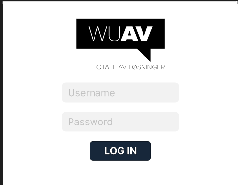
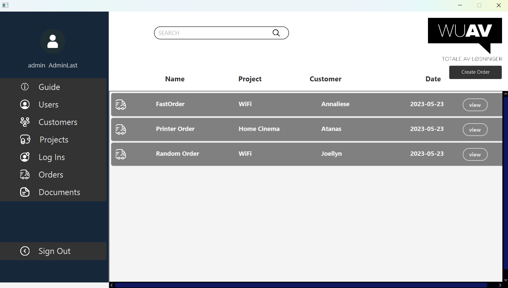
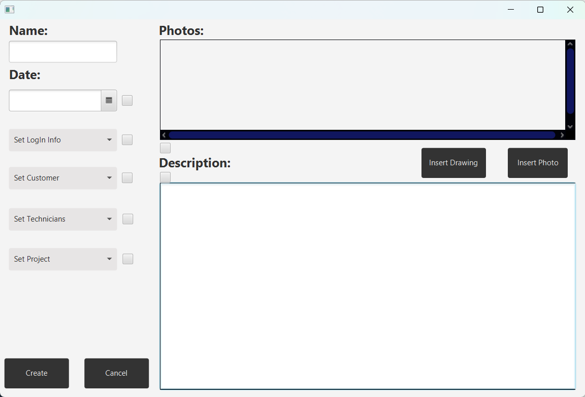
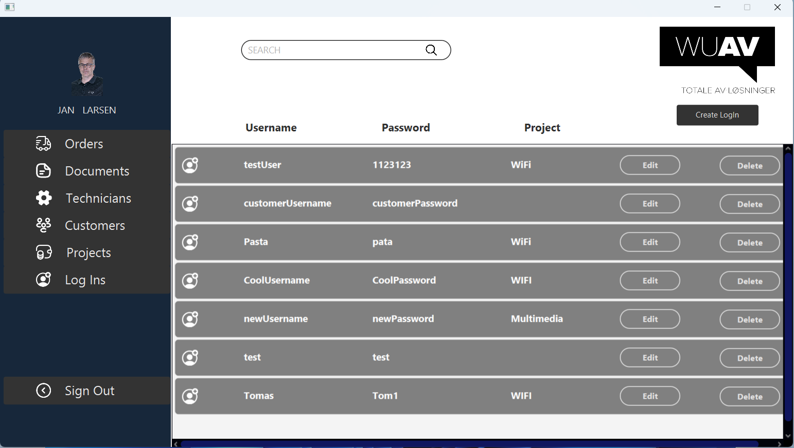

# WUAV Documentation Manager

## Introduction

Welcome to the WUAV Documentation Manager project! Our primary goal is to satisfy the CEO of WUAV, our esteemed customer, by delivering a high-quality software solution. We've invested significant time brainstorming ideas to ensure we meet the client's requirements and are confident in our ability to provide an excellent product by the project's end. While there may be some roadblocks ahead, it's typical at this stage of development.

## Project Objectives

1. **Customer Satisfaction**: Our utmost priority is to meet and exceed the expectations of the CEO of WUAV.

2. **User-Friendly Interface**: We aim to create an intuitive and easy-to-use application for the future users of our software. Our vision includes allowing users to add drawing layouts, descriptions, and pictures of installations, and generate printable PDF documentation with just a click.

## Approach

1. **User Experience**: We're committed to delivering the best user experience possible. Our focus is on creating a user-friendly interface that not only pleases the customer but also ensures ease of use for their employees.

2. **UI Design Patterns**: We'll implement proven UI design patterns to ensure a cohesive and intuitive user interface. This will facilitate any future changes to the UI by providing a clear vision to UI designers.

3. **SOLID Principles**: We'll adhere to the SOLID principles in our codebase, particularly focusing on Java's object-oriented nature. By doing so, we aim to maximize the potential of the language and ensure maintainability and scalability of our software.

## How to Use

### Running the Application

The application can be run directly from IntelliJ IDEA IDE with the following libraries. If they are not already set due to Maven, you may need to configure them:

- Javafx-sdk-20
- io.github.palexdev.materialfx
- com.itextpdf:itextpdf:5.5.13.3
- mssql-jdbc-11.2.1.jre8

### User Credentials

To login and use the system, you can use the following credentials:

**Admin:**
- Username: Admin
- Password: adminPass

**Technician Manager:**
- Username: janTheManager
- Password: techManager

**Technician:**
- Username: perTheTechnician
- Password: technician1

**Seller:**
- Username: peterTheSeller
- Password: seller

## Photos of the application

### Login Page

### Orders Page

### Documents Page

### Creating Document Page

### Log Ins Page

